# Linspector

In page Fetch, XHR, WebSocket and SSE interceptor with a built in security toolkit for testing.

English | [Русский](README.ru.md)

> Disclaimer: Linspector is written strictly for educational purposes and for authorized security testing. Only use it on systems that you own or have explicit written permission to test. The active tools (Repeater, Tamper, breakpoints, payload library) send and modify real requests, so never point them at systems you are not allowed to test. The authors accept no liability for misuse.

## Logo


## Screenshots

<table>
  <tr>
    <td align="center">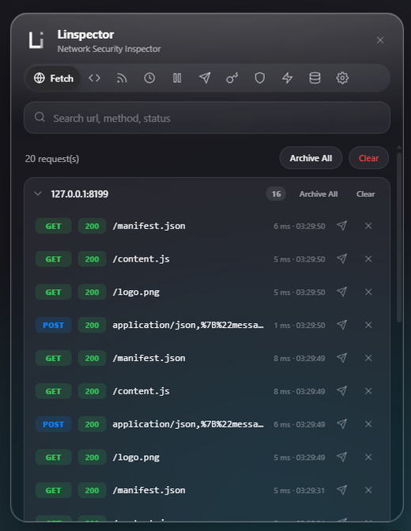<br /><sub><b>Fetch</b></sub></td>
    <td align="center">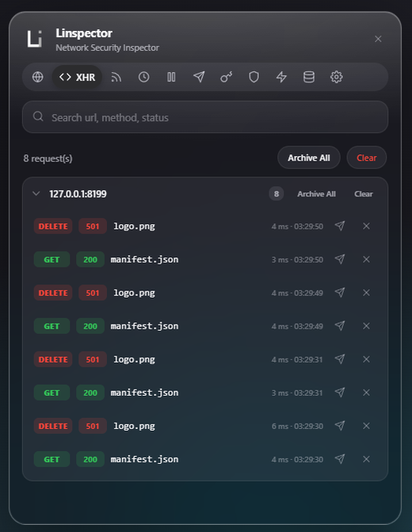<br /><sub><b>XHR</b></sub></td>
    <td align="center">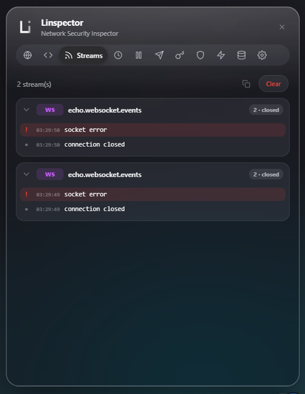<br /><sub><b>Streams</b></sub></td>
  </tr>
  <tr>
    <td align="center">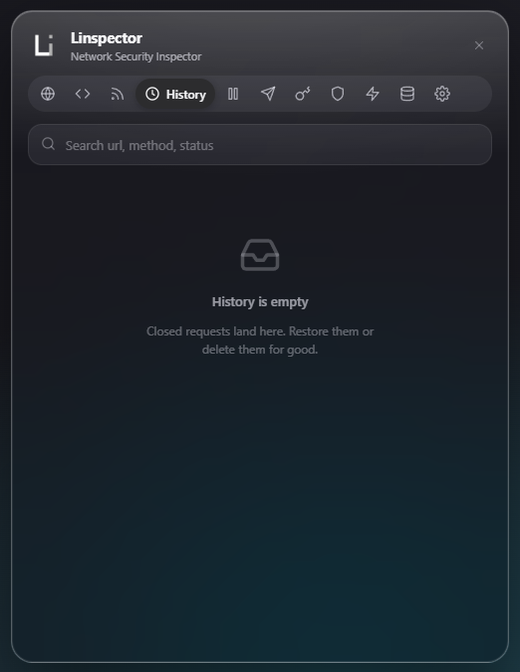<br /><sub><b>History</b></sub></td>
    <td align="center">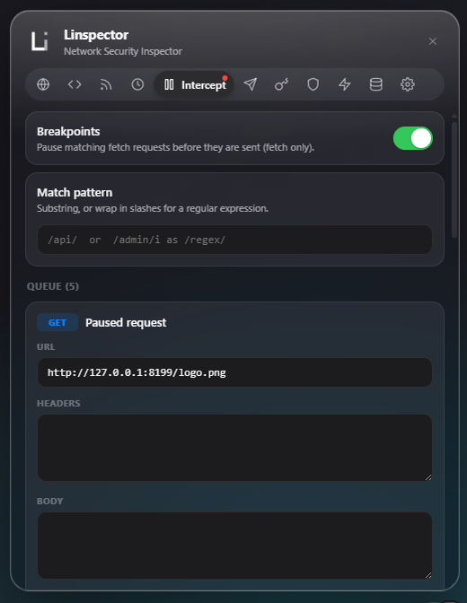<br /><sub><b>Intercept</b></sub></td>
    <td align="center">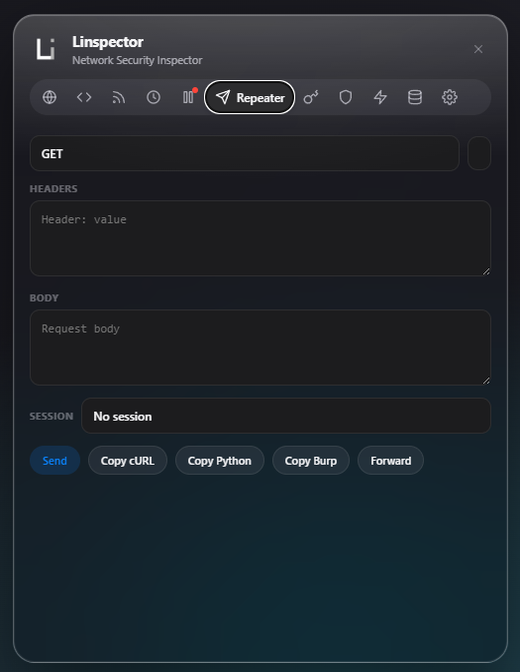<br /><sub><b>Repeater</b></sub></td>
  </tr>
  <tr>
    <td align="center">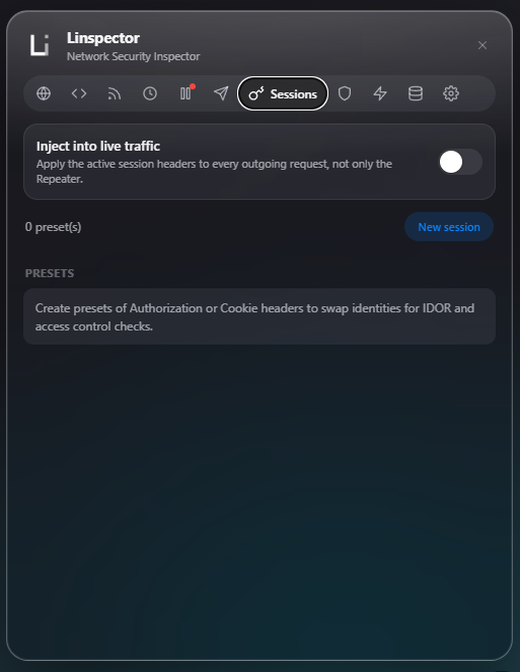<br /><sub><b>Sessions</b></sub></td>
    <td align="center">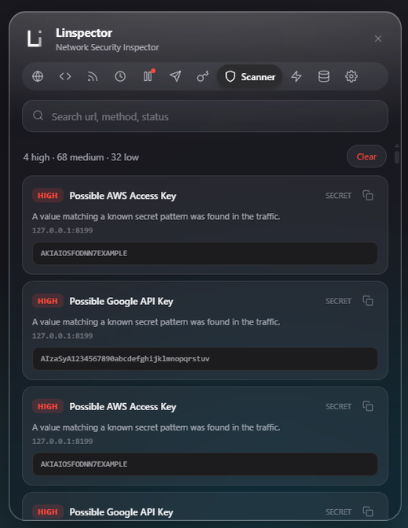<br /><sub><b>Scanner</b></sub></td>
    <td align="center">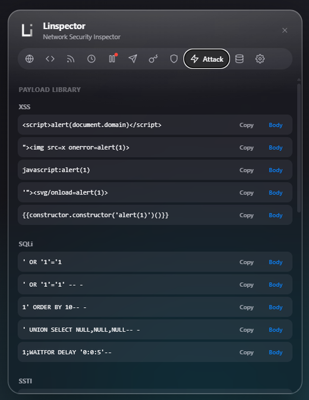<br /><sub><b>Attack</b></sub></td>
  </tr>
  <tr>
    <td align="center">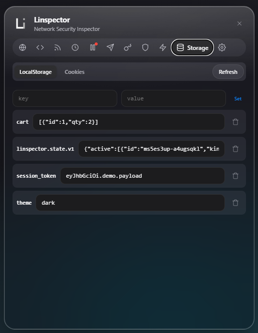<br /><sub><b>Storage</b></sub></td>
    <td align="center">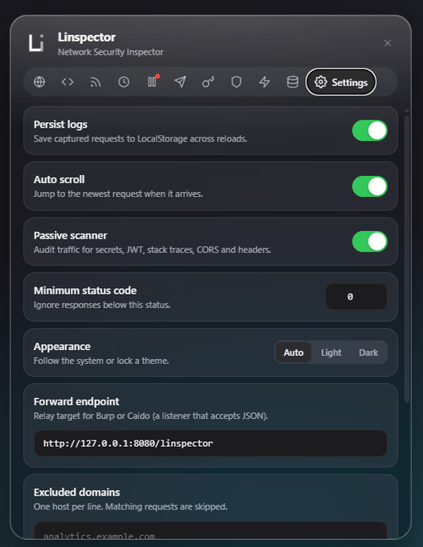<br /><sub><b>Settings</b></sub></td>
    <td></td>
  </tr>
</table>

## Features

- Live capture of Fetch and XHR with request and response headers, payload, body and timing.
- WebSocket and Server Sent Events capture with a per connection frame log.
- Requests grouped into sectors by host, each with Archive All and Clear, plus History with restore and delete.
- Repeater to edit and resend any request, with cURL, Python and Burp export.
- Breakpoints that pause matching fetch requests so you can edit, forward or drop them.
- Tamper rules for automatic replacement inside the URL, body or headers, with regex support.
- Auth and session switcher with header presets for fast IDOR and broken access control checks.
- Passive security scanner: JWT decode and audit, secret and API key detection, stack trace disclosure, CORS and security header audit.
- Attack tools: payload library for XSS, SQLi, SSTI and SSRF, a response diff and a JWT decoder.
- Forwarding of a request to a Burp Suite or Caido relay endpoint.
- LocalStorage and cookie inspector with a cookie attribute audit.
- Live search, minimum status filter, excluded domains, LocalStorage persistence and theme selection.

## Security checks

| Vulnerability                  | What it is                                                                                                                                             | How Linspector finds or tests it                                                                                                                                        |
| ------------------------------ | ------------------------------------------------------------------------------------------------------------------------------------------------------ | ----------------------------------------------------------------------------------------------------------------------------------------------------------------------- |
| JWT weaknesses                 | Tokens signed with `alg: none`, weak HMAC secrets, or missing and expired claims let an attacker forge or reuse sessions                               | The passive scanner decodes every Bearer JWT and flags `none`, HMAC, expired `exp` and missing `exp` or `iat`. The Attack tab also has a manual JWT decoder and auditor |
| Secret and API key leakage     | AWS, Google, Slack, GitHub and Stripe keys, private keys or bearer tokens exposed in traffic give direct access to services                            | The passive scanner runs a regex library over request and response bodies and reports each match with a clipped evidence snippet                                        |
| Stack trace disclosure         | Server error traces in responses reveal frameworks, file paths and internal logic                                                                      | The scanner detects Python, Node, Java and generic stack traces in response bodies and raises a finding                                                                 |
| CORS misconfiguration          | A wildcard `Access-Control-Allow-Origin` together with credentials lets any origin read authenticated responses                                        | The header audit inspects response CORS headers and flags wildcard origin, especially when combined with `Allow-Credentials: true`                                      |
| Missing security headers       | Absent CSP, X-Frame-Options, HSTS, X-Content-Type-Options or Referrer-Policy leaves the page open to clickjacking, MIME sniffing and downgrade attacks | The header audit checks each response and lists the missing headers with severity                                                                                       |
| Insecure cookies               | Cookies without Secure, HttpOnly or SameSite can be stolen over HTTP, read by scripts or sent cross site                                               | The Storage inspector lists cookies and flags every missing attribute                                                                                                   |
| IDOR and broken access control | Reaching another user object by swapping an id or token exposes data the current user should not see                                                   | The Session switcher stores token presets, and the Repeater resends the same request under a different identity so you can compare the access granted                   |
| XSS                            | Unsanitised input reflected or stored and executed as script runs attacker code in the victim browser                                                  | The payload library provides XSS vectors, Tamper and the Repeater inject them, and Response diff compares the answers to spot reflection                                |
| SQL injection                  | Untrusted input reaching a SQL query can read or change the database                                                                                   | The payload library provides SQLi probes for the Repeater, and Response diff highlights behavioural or timing changes between payloads                                  |
| SSTI                           | User input evaluated by a server side template engine can lead to remote code execution                                                                | The payload library provides SSTI probes such as `{{7*7}}` to send through the Repeater and observe the rendered output                                                 |
| SSRF                           | The server fetches an attacker controlled URL and can reach internal services and cloud metadata                                                       | The payload library provides SSRF targets such as `127.0.0.1`, `169.254.169.254` and `file://` for the Repeater                                                         |

## Tech stack

- TypeScript with strict compiler settings.
- esbuild for bundling into Manifest V3 content scripts.
- Shadow DOM for full isolation from the host page.
- Vanilla DOM rendering, no runtime dependencies.
- Vitest for unit tests, ESLint and Prettier for quality.

## Architecture

```
src/
  interceptor.ts        MAIN world script: patches fetch, XHR, WebSocket and SSE
  content.ts            ISOLATED world entry: bridge, store and UI
  core/
    types.ts            shared data model
    bus.ts              two way message protocol
    bridge.ts           postMessage transport
    ids.ts              id helper
  store/                observable state, settings and LocalStorage persistence
  tamper/               tamper and auto replace rules, shared by interceptor and UI
  security/             jwt, secrets, header audit and the scan orchestrator
  attack/               curl, python and burp export, payload library, response diff
  repeater/             request resend and relay forwarding
  inspect/              LocalStorage and cookie access
  utils/                colors, formatting, url and header helpers
  ui/                   panel controller, shared parts and per tab views
```

The interceptor runs in the page main world so it can wrap the real network APIs. It streams records and stream frames to the isolated content script over `window.postMessage`, and receives runtime configuration and breakpoint decisions back on the same channel. The content script owns the store and renders the panel inside a Shadow DOM root.

## Install and build

Requirements: Node.js 18 or newer.

```bash
npm install
npm run build
```

The build output is written to `dist/`.

## Load in the browser

1. Open `chrome://extensions`.
2. Enable Developer mode.
3. Click Load unpacked and select the `dist/` folder.
4. Open any page and use the floating button in the bottom right corner.

Requires a Chromium browser version 111 or newer for main world content scripts.

## Usage notes

- Breakpoints apply to fetch requests. Tamper rules and session injection apply to both fetch and XHR.
- The Repeater resends through the extension context with credentials included and follows the same origin rules of the page.
- Forwarding posts the serialized request as JSON to the endpoint in Settings. Point it at a local Burp or Caido listener that accepts JSON, or use the Burp export to paste a raw request into Repeater. The cURL export supports the `-x` proxy flag for routing through a proxy.
- The scanner is passive. It only reads traffic that the page already generates.

## Development

```bash
npm run dev          # rebuild on change
npm run typecheck    # type checking
npm run lint         # eslint
npm run format       # prettier write
npm test             # unit tests
npm run check        # typecheck, lint, format check and tests
```

## Author

Developed by [liwidale](https://github.com/liwidale).

## License

Released under the [MIT License](LICENSE).
